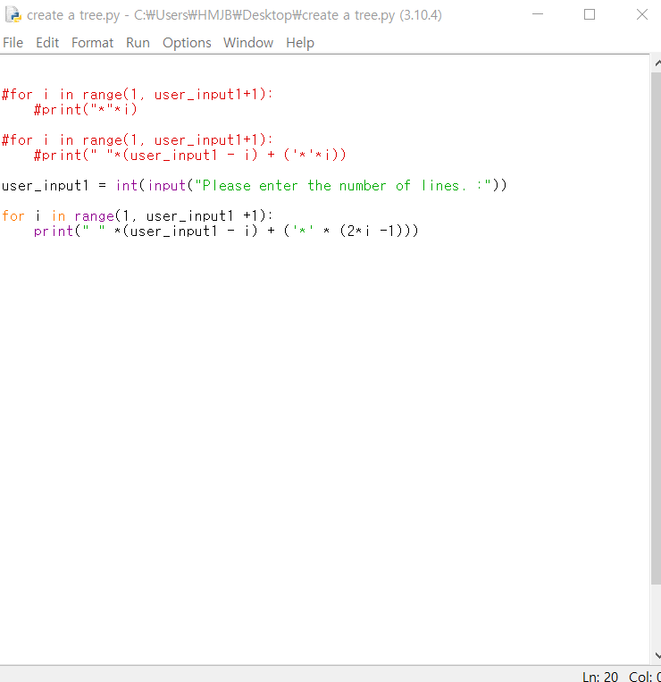
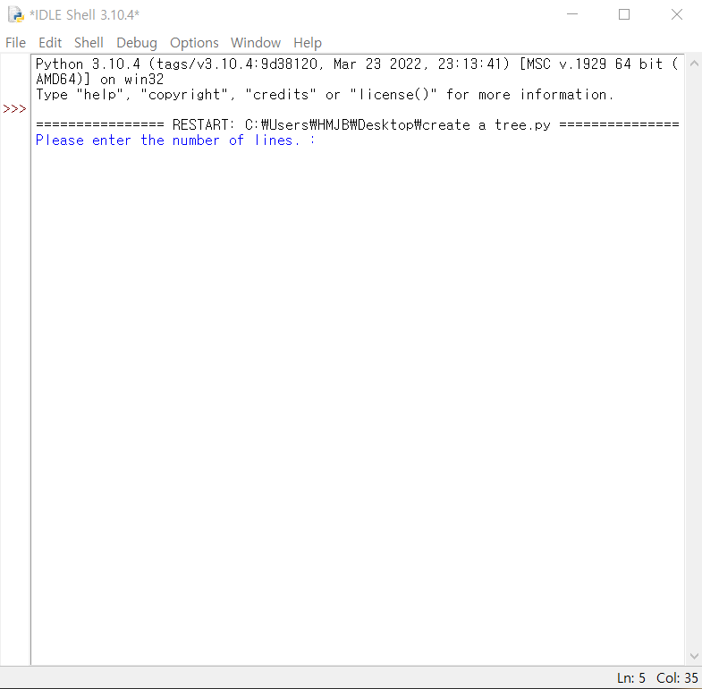
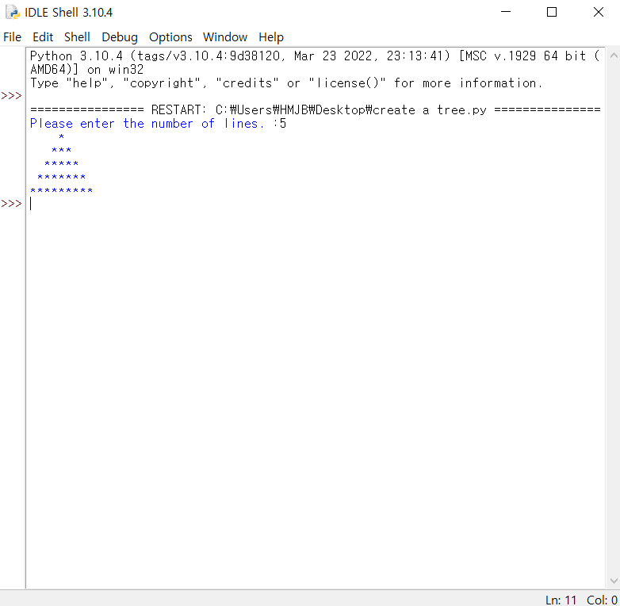

About
=====
This program can make a tree by star.

How to use the Program
=====
If you enter the number of lines you want, the tree will be as long as that number

Description of Example Runs
====
</image>
</image>
</image>
